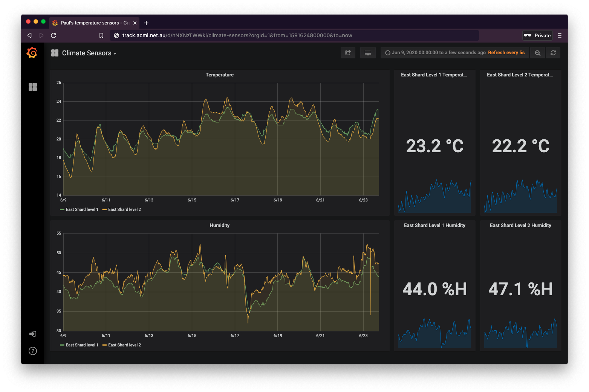
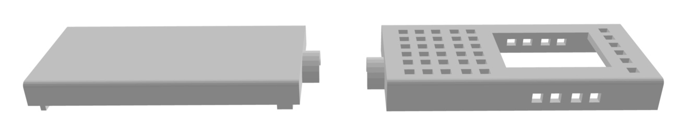
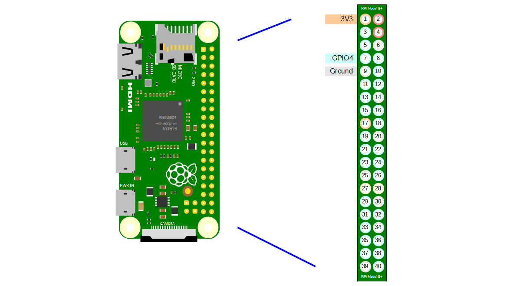

Climate Sensor
==============

A Raspberry Pi with a DFRobot DHT22 sensor to measure temperature and humidity and export that data to a monitoring and graphing server.


## Features

* Measures Temperature in Celcius °C
* Measures Humidity in Relative Humidity %
* Exposes the climate sensor data on an http server on port `1006` e.g. [http://<ip_address>:1006](http://<ip_address>:1006)
* Compatible with [Prometheus](https://prometheus.io)


## Monitoring & Graphing

There's a [Prometheus](https://prometheus.io) [client](https://github.com/prometheus/client_python) in `read_sensors.py` that exports the climate data.

We use a [Grafana](https://grafana.com) dashboard to view the data.



## Hardware

This Climate Sensor is designed to run with the following hardware:

* [Raspberry Pi Zero W](https://www.raspberrypi.org/products/raspberry-pi-zero-w/)
* [DFRobot DHT22 v2 sensor](https://www.dfrobot.com/product-1102.html)
* [JST PH 3-Pin to Female Socket Cable](https://core-electronics.com.au/jst-ph-3-pin-to-female-socket-cable-200mm.html)
* [3D-printed sensor case](case)

**Note**: It will run on any model of Raspberry Pi, but for conservation of electricity and minimising heat production we recommend the Zero.

### 3D-printed case

See the [case README](case) for more information about the 3D-printable sensor case.

[](case)

## Wiring diagram

With your Raspberry Pi pins on the right-hand side of the board, using the pin numbering system in the following diagram, attach the DHT22 cables to the Raspberry Pi pins in the table below:

| Raspberry Pi pin | DFRobot DHT22 pin |
| - | - |
| 1 - 3V3 Power | Red power cable |
| 7 - RPI04 | Green/White data cable |
| 9 - Ground | Black ground cable |



## Installation on developer machine

* Clone this repository.
* `cd development`
* `cp dev.tmpl.env dev.env`
* Edit the `dev.env` to change the frequency of sensor readings, the default is every 5 seconds `TIME_BETWEEN_READINGS=5`
* Set `DEBUG=true` to see errors on the console
* Set `SENSOR_PIN=4` to change the Raspberry Pi pin you connect the sensor to. Default is 4
* Build and run the development container `docker-compose up --build`

## Testing and linting

`docker exec -it climate make linttest`

## Deploying via Balena Cloud

Clone this repo and make any edits to `read_sensors.py` that you need.

Add the Balena remote to:

```bash
git remote add balena <username>@git.balena-cloud.com:<username>/<balena-app-name>.git
```

And then push the changes to deploy via Balena:

```bash
$ git commit -S -am "My new feature"
$ git push
$ git push balena master
```

Watch the devices update on the [Balena dashboard](https://dashboard.balena-cloud.com).

## Deploying via Balena Cloud as a multi-container app

To add a Climate Sensor to a multi-container Balena app:

* Add this repository as a git submodule `git submodule add git@github.com:ACMILabs/climate-sensor.git climate`
* Update your `docker-compose.yml` to include the `climate` app:

```yaml
version: '2'
services:
  climate:
    build: ./climate
    privileged: true
    labels:
      io.balena.features.supervisor-api: '1'
    ports:
      - "1006:1006"
```

If you'd like to update the `climate` submodule: `git submodule update --remote`

## Credits

This project was built by the [ACMILabs](https://labs.acmi.net.au) team in 2019.

[MPL License](LICENSE)
